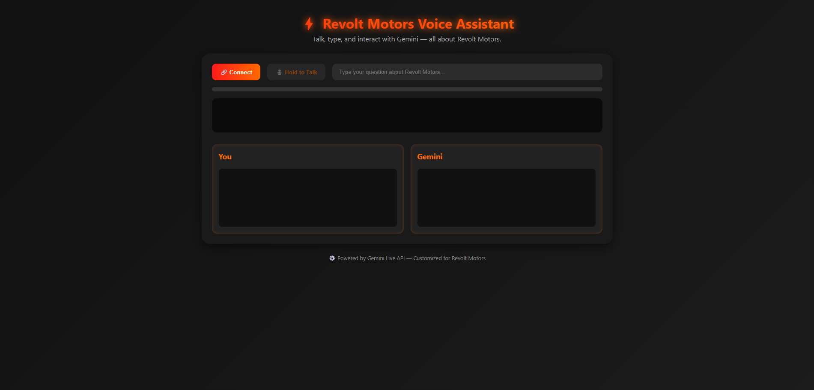

# Revolt Motors Gemini Live: Server‑to‑Server Voice Chat (Native Audio)



This is a minimal end‑to‑end example that streams microphone audio from the browser
-> your Node.js server -> Gemini Live API (native audio model), and streams audio back.

## Features
- Server‑to‑server architecture: API key only on the backend.
- Uses **native audio** model `gemini-2.5-flash-preview-native-audio-dialog`.
- Full‑duplex audio: speak, interrupt, get responses as 24kHz PCM.
- Barge‑in supported (default in Live API).
- Input & output transcriptions shown in the UI.

## Prerequisites
- Node.js 18+
- A Google **Gemini API key** with Live API access.
- Chrome/Edge for best AudioWorklet support.

## Quick start
```bash
cd server
cp .env.example .env        # paste your GEMINI_API_KEY
npm install
npm run dev
```
Open http://localhost:3000 in your browser (the dev server also serves the client).

## Notes
- Mic is captured at 48kHz then downsampled to 16kHz PCM16 before sending to the server.
- Gemini returns 24kHz PCM16; the client schedules playback using WebAudio.
- Interruption: start speaking any time — the model's audio is cut off.
- This is a learning starter; production should add auth, rate limiting, and reconnection logic.


## Useful docs
- Get started with Live API: https://ai.google.dev/gemini-api/docs/live
- WebSockets API reference: https://ai.google.dev/api/live
- AI Studio Live: https://aistudio.google.com/live
```